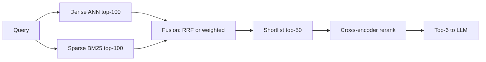

- To search fast, vector databases use ANN (Approximate Nearest Neighbor) algorithms like HNSW or IVF.

- **Recall** in vector retrieval measures the percentage of true, mathematically closest vectors that your search query actually finds

# Deep Dive: Hybrid Fusion + Rerank, and Vector DB Sharding

---

## Part 1 — Hybrid Fusion + Rerank Implementation

### 1.1 The retrieval pipeline shape

## Simple Shard Calculation

### Step 1 — Count your vectors
$$
N = \text{docs} \times \text{chunks per doc}
$$
Example: $1\text{M docs} \times 30 = 30\text{M vectors}$

### Step 2 — Bytes per vector (after quantization)
$$
\text{bytes/vec} = \underbrace{d \times b}_{\text{vector}} + \underbrace{\sim200}_{\text{graph overhead}}
$$
- $d$ = dimension (e.g. 768)
- $b$ = bytes/dim → float32 = 4, **int8 = 1**

Example (int8): $768 \times 1 + 200 \approx 1\text{ KB/vec}$

### Step 3 — How many vectors fit per node
$$
N_{\text{shard}} = \frac{\text{RAM budget per node}}{\text{bytes/vec}}
$$
Example: $\dfrac{8\text{ GB}}{1\text{ KB}} = 8\text{M vectors/shard}$

### Step 4 — Number of shards
$$
S = \left\lceil \frac{N}{N_{\text{shard}}} \right\rceil
$$
Example: $\lceil 30\text{M} / 8\text{M} \rceil = 4 \text{ shards}$

### Step 5 — Total nodes (add replicas for HA)
$$
\text{nodes} = S \times R
$$
Example: $4 \times 3 = 12 \text{ nodes}$

---

### One-line memory formula
$$
\text{Total RAM} = N \times \text{bytes/vec}
$$
$30\text{M} \times 1\text{ KB} = 30\text{ GB} \Rightarrow$ split into 4 shards of ~7.5 GB each.

**Cheat sheet:**

| Symbol | Meaning | Example |
|--------|---------|---------|
| $N$ | total vectors | 30M |
| bytes/vec | after int8 | ~1 KB |
| $N_{\text{shard}}$ | RAM ÷ bytes/vec | 8M |
| $S$ | $\lceil N / N_{\text{shard}} \rceil$ | 4 |
| $R$ | replicas | 3 |
| nodes | $S \times R$ | 12 |

**Rule of thumb:** size each shard to a few million vectors so its index fits in RAM and searches fast, then replicate ×2–3.

### Sharding strategy: random vs semantic

| Strategy | How | Pro | Con |
|----------|-----|-----|-----|
| **Random/hash** | hash(chunk_id) % S | even load, simple | every query hits all shards |
| **Semantic** (cluster-based) | route by nearest centroid | query only relevant shards ⇒ less compute | hot shards, rebalancing needed |

Start with **random sharding** (predictable, balanced). Move to semantic routing only if compute cost dominates and your data clusters cleanly.

### Putting the numbers together (final sizing)

For **30M vectors, d=768**, targeting low latency + high recall:

- **Index**: HNSW + **int8 scalar quantization** (or IVF-PQ if memory-constrained).
- **Memory**: ~29 GB total (int8) → **4 shards** of ~7.5M vectors (~7 GB each).
- **Replication**: R=3 → **12 nodes**.
- **HNSW params**: M=32, efConstruction=200, efSearch=64–128 (efSearch = recall/latency dial).
- **Query**: parallel scatter-gather across 4 shards, ~64–128 comparisons per HNSW hop, per-shard latency ~10–30 ms → **p95 retrieval < 80 ms**.
- **Then**: fuse with BM25 (RRF) → rerank top-50 → top-6 to LLM.

### Key parameter cheat-sheet

| Parameter | Formula / default | Effect |
|-----------|-------------------|--------|
| HNSW `M` | 16–32 | graph degree; ↑ = recall + memory |
| HNSW `efSearch` | 64–256 | ↑ = recall + latency |
| IVF `nlist` | $\approx \sqrt{N}$ | partition granularity |
| IVF `nprobe` | 8–64 | ↑ = recall + latency |
| PQ `m` | divisor of $d$ | ↑ = fidelity, ↓ compression |
| Shard count `S` | $\lceil N / N_{\text{shard}}^{\max}\rceil$ | fit RAM + latency |
| Replicas `R` | 2–3 | HA + throughput |

---

**Bottom line:**
- **Fusion**: RRF ($k=60$) for robust rank-based combination; cross-encoder rerank on the top-50 is the biggest precision lever.
- **Quantization**: int8 gives 4× shrink at ~99% recall (start here); PQ/IVF-PQ gives 16–32× for extreme scale, paired with full-vector reranking to recover precision.
- **Sharding**: size shards to fit ~few-M vectors in RAM, parallel scatter-gather bounds latency by the slowest shard, replicate ×3 for HA.

--- 

### Bi-Encoder

> "The same embedding model independently encodes the query and documents into vectors. Document embeddings are precomputed and stored in a vector database. At query time, the query embedding is compared against stored document embeddings using vector similarity to retrieve the top candidates."

### Cross-Encoder(A Reranker)

> "The cross-encoder takes the raw query text and raw document text together as input, allowing all query tokens to attend to all document tokens. It outputs a relevance score for reranking the retrieved candidates. Since the query and document must be processed together, document representations cannot be precomputed."

---

# Bi-Encoder vs Cross-Encoder

| Feature                    | Bi-Encoder            | Cross-Encoder               |
| -------------------------- | --------------------- | --------------------------- |
| Input                      | Query **or** Document | Query **+** Document        |
| Input type                 | Raw text (separately) | Raw text (together)         |
| Output                     | Embedding vector      | Relevance score             |
| Documents precomputed?     | ✅ Yes                 | ❌ No                        |
| Query-document interaction | ❌ No                  | ✅ Yes                       |
| Search method              | Vector similarity     | Transformer inference       |
| Speed                      | Very fast             | Slow                        |
| Best use                   | Initial retrieval     | Reranking                   |
| Scale                      | Millions of docs      | Top 50–200 retrieved chunks |
