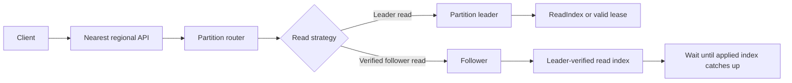
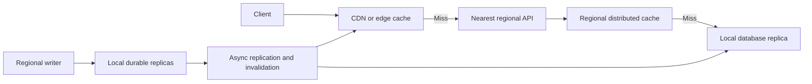
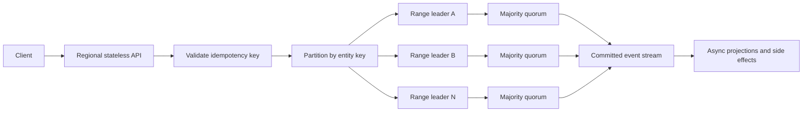
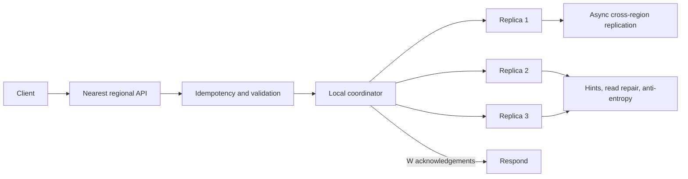

## Requirements and assumptions

The system must handle **1 million requests per second on average**. The
requests and responses contain small JSON payloads, and users are distributed
globally. The design must cover both strong and eventual consistency because
the selected contract changes the read path, write path, latency, and failure
behavior. Noncritical work may run asynchronously. During overload, the client
receives a useful status message instead of an unexplained failure.

Assume the following targets until the interviewer provides exact values:

* Average traffic: 1 million RPS
* Provisioned peak: 2 to 3 million RPS
* Payload: approximately 1 KB per request or response
* Latency: p95 below 200 ms and p99 below 500 ms
* Availability: multi-region
* Consistency: compare linearizable and eventual models
* Durability: a successful write is durably accepted according to its API
  contract, independent of when every replica becomes consistent

> [!IMPORTANT]
> Consistency, durability, and asynchronous processing are separate concerns.
> Under strong consistency, `200` or `201` means the authoritative write
> committed to a quorum. Under eventual consistency, it may mean the write is
> durable in the accepting region but has not reached every replica. A `202
> Accepted` response means a durable command was accepted, but its state
> transition may still be pending.

## Shared capacity estimates

The daily request volume is:

$$
1{,}000{,}000 \times 86{,}400 = 86.4\text{ billion requests/day}
$$

At 1 KB per request or response, traffic is roughly 1 GB/s, or 8 Gbps, in the
relevant direction. TLS, HTTP headers, replication, retries, and internal RPCs
increase the real network requirement. Capacity planning must also include
regional failover and 2 to 3 times the average traffic.

The shared request path is:


The edge handles TLS termination, DDoS protection, authentication checks,
request-size limits, and per-client quotas. Regional stateless API fleets scale
horizontally. For strong consistency, the partition router maps each key to the
leader of its Raft or Paxos group. For eventual consistency, it maps the key to
a nearby replica or coordinator in a leaderless, primary-replica, or
multi-leader store.

## Scenario A: 95% reads and 5% writes

### Scale and primary constraint

This workload produces:

* 950,000 reads per second, or 82.08 billion reads per day
* 50,000 writes per second, or 4.32 billion writes per day
* Approximately 4.32 TB/day of raw new write data at 1 KB per write, before
  replication, indexes, logs, and metadata

The primary challenge is scaling **strongly consistent reads**. An ordinary CDN
or Redis cache cannot authoritatively serve mutable records because a completed
write may not yet be reflected in the cache.

### Read path



Use one of these read strategies:

1. Route the read to the partition leader. Before responding, the leader uses
   `ReadIndex` or a valid leader lease to prove it has not been deposed.
2. Let a follower request a leader-verified read index, wait until its local
   applied index reaches that value, and then serve the local data.
3. Return the committed log index or record version after a write. A subsequent
   follower read waits until `appliedIndex >= requiredVersion`. This provides
   read-your-writes but still needs a quorum-backed barrier for global
   linearizability.

Distribute many partition leaders across many database nodes. There is no
single global leader. If 1,000 logical ranges distribute traffic evenly, each
range receives approximately 950 reads/s and 50 writes/s. Benchmark the chosen
database to determine the actual range count and physical node count.

### Safe caching

Use CDN, regional, and process caches for:

* Immutable content
* Static assets and configuration
* Content-addressed or versioned objects
* Responses whose contract explicitly permits bounded staleness

Do not place mutable, linearizable reads behind a normal TTL cache. A
consistency-aware cache is possible only when the authoritative store
coordinates versions or invalidation before a write is acknowledged. That
coordination adds complexity, so leader reads or verified follower reads are
the safer interview default.

### Write path

```text
Client -> API -> partition leader -> quorum replication -> commit -> response
                                                    |
                                                    v
                                            durable event stream
                                                    |
                                                    v
                              notifications, search, analytics, cache updates
```

All writes for a key go to its partition leader. The leader orders the write,
replicates it to a majority, commits it, and then returns success. Search
indexing, notifications, analytics, and derived views consume committed events
asynchronously.

### Eventual-consistency alternative for read-heavy traffic

Eventual consistency changes the main optimization: serve almost every read
from the closest available copy and reconcile updates in the background.



The 950,000 reads/s can be absorbed through multiple layers:

* Serve public and cacheable responses from the CDN using TTL and
  `stale-while-revalidate`
* Serve application data from regional Redis clusters or local database
  replicas without a leader freshness barrier
* Use cache-aside or read-through caching, request coalescing, negative caching,
  and TTL jitter to prevent stampedes
* Partition hot cache keys and replicate popular objects across cache nodes
* Carry a version or `ETag` so clients can detect changes and avoid downloading
  unchanged JSON

Writes are durably stored in the accepting region and propagated to caches,
read replicas, and other regions asynchronously. The write response may include
a version or session token. Sending that token on a later read enables optional
read-your-writes consistency: a replica waits for the version, routes to a
newer replica, or returns the value from the writer's region. Reads without the
token may return an older value.

Eventual consistency still needs a bounded-staleness objective. Track
replication lag and define a target such as 99.9% of updates visible worldwide
within five seconds. Use CDC or an outbox for invalidations, anti-entropy and
read repair for missed updates, and versioned cache keys when stale
invalidations are dangerous.

For only 5% writes, a partitioned primary with asynchronous followers is often
simpler than active-active writes. If writes must remain available in every
region during a partition, use a multi-leader or leaderless database and define
conflict resolution explicitly through last-write-wins, version vectors,
application merges, or CRDTs. Last-write-wins can discard a valid concurrent
update, so use it only when that behavior is acceptable.

### Strong-consistency read-heavy interview response

> At 1 million average RPS with 95% reads, I would focus on distributing
> 950,000 strongly consistent reads per second. I would partition the data into
> many Raft or Paxos groups and spread their leaders across the database fleet.
> Writes go to the owning leader and are acknowledged after majority commit.
> Mutable reads go either to the leader using ReadIndex or a lease, or to a
> follower that first obtains a leader-verified commit index and catches up to
> it. CDN and Redis serve only immutable, versioned, or explicitly stale data.
> Stateless API servers scale across regions, while noncritical work consumes
> committed events asynchronously. I would provision for 2 to 3 million RPS
> and validate leader load, follower lag, hot keys, and regional failover with
> production-like load tests.

### Eventual-consistency read-heavy interview response

> At 1 million average RPS with 95% reads, eventual consistency lets me serve
> users from the nearest copy instead of coordinating each read with a leader.
> I would place cacheable JSON at the CDN, use regional distributed caches, and
> read misses from local database replicas. The 50,000 writes per second would
> be durably accepted in the owning region and propagated through CDC or a
> durable log to replicas and caches asynchronously. I would use TTL jitter,
> request coalescing, versioned values, and negative caching to prevent cache
> stampedes. Where needed, a write-version token provides read-your-writes
> consistency without making every read linearizable. I would define and
> measure a convergence SLO, replication lag, stale-read rate, cache hit rate,
> and behavior during regional partitions.

## Scenario B: 5% reads and 95% writes

### Scale and primary constraint

This workload produces:

* 50,000 reads per second, or 4.32 billion reads per day
* 950,000 writes per second, or 82.08 billion writes per day
* Approximately 82.08 TB/day of raw new write data at 1 KB per write
* Approximately 246.24 TB/day with three replicas, before indexes, commit logs,
  backups, compaction, and metadata

The primary challenge is **strongly consistent write throughput**. A single
leader cannot handle 950,000 writes/s, so the design requires many independent
partition leaders, even key distribution, low cross-partition coordination,
and a clear retention policy.

### Partitioned write path



Choose a high-cardinality partition key such as `account_id`, `tenant_id`, or
`user_id`. Hash it to distribute writes, while preserving a single owning
partition for operations that must be serialized. With 1,000 evenly loaded
logical ranges, each leader receives approximately 950 writes/s. This is only a
starting estimate; storage engine benchmarks, record contention, replication
latency, and transaction size determine the required range and node counts.

Use automatic range splitting and rebalancing, but preserve these rules:

* Keep single-record and single-partition transactions on one consensus group
* Minimize cross-partition transactions because they require 2PC over multiple
  consensus groups
* Detect and isolate hot tenants or hot keys
* Use append-only or LSM-oriented storage when access patterns permit it
* Batch internal replication and event publication without changing the
  external durability guarantee
* Apply backpressure before storage queues become unbounded

### Hot-key limitation

Salting a hot key improves throughput only when the operation can be split and
recombined, such as analytics counters. It cannot safely split an invariant
that requires one serial order, such as an account balance or unique inventory
reservation. For those records, one leader remains the serialization point.
Use admission control, per-key queues, escrow or reservation models, or a
redesigned invariant rather than claiming unlimited horizontal scale.

### Asynchronous acceptance

Two API modes are valid:

```json
{
  "status": "committed",
  "version": 481516,
  "requestId": "req-123"
}
```

Return `200` or `201` only after the database quorum commits the mutation.

```json
{
  "status": "accepted",
  "operationId": "op-456",
  "message": "Your request has been accepted and is being processed."
}
```

Return `202 Accepted` after durably recording an idempotent command. Preserve
per-key ordering in the command log. The client checks the operation resource
or receives a callback when the authoritative state transition commits. The
`202` response does not claim that the mutation is already visible.

Each write carries an idempotency key. Retries return the original operation or
result instead of applying the mutation twice. Use a transactional outbox or a
database change stream so committed state changes and emitted events cannot
silently diverge.

### Eventual-consistency alternative for write-heavy traffic

Eventual consistency removes the cross-region consensus round trip from the
normal write path. A Dynamo-style leaderless database such as Cassandra or
ScyllaDB is a natural fit when the data model supports partition-key access and
does not require cross-key ACID transactions.



Hash a high-cardinality partition key across many nodes and use an LSM-tree
storage engine so writes append to a commit log and memtable rather than update
pages in place. A local coordinator sends each mutation to the replicas for
that key and responds after the configured write consistency level succeeds.

For replication factor $N=3$, common choices include:

| Write level | Acknowledgement point | Trade-off |
|-------------|-----------------------|-----------|
| `ONE` | One replica persists the write | Lowest latency and highest risk if that replica fails before replication |
| `LOCAL_QUORUM` | Two local replicas persist it | Better local durability with no cross-region round trip |
| `ALL` | Every replica persists it | Highest latency and lowest write availability |

Eventual consistency does not require unsafe acknowledgement. For this
workload, `LOCAL_QUORUM` plus asynchronous cross-region replication is a
practical default when losing an acknowledged regional write is unacceptable.
It remains eventually consistent globally because remote regions may lag.
Choose `ONE` only when its durability trade-off is accepted.

At 950,000 writes/s, apply these mechanisms:

* Buffer bursty commands in a partitioned durable log and return `202` after
  durable acceptance when the API allows delayed completion
* Batch writes by destination partition and compress network payloads
* Keep secondary indexes and materialized views asynchronous to protect the
  ingestion path
* Use idempotency keys and event IDs because retries and repair can redeliver
  mutations
* Monitor partition size, disk bandwidth, compaction debt, tombstones, queue
  lag, and cross-region replication lag
* Add nodes and virtual partitions to rebalance sustained load

Concurrent writes to the same key can arrive in different regions. Resolve
them with a domain-specific strategy rather than relying blindly on wall-clock
timestamps. CRDT counters and sets preserve mergeable updates; version vectors
detect concurrency; application merges preserve business meaning. Operations
that require an invariant such as unique inventory, nonnegative balance, or
global uniqueness still need a conditional consensus operation, a single home
region, escrowed capacity, or a redesigned workflow.

Reads contact a local replica for minimum latency. A coordinator may query
multiple replicas and reconcile the newest version, while read repair and
anti-entropy converge older copies. Quorum overlap can improve freshness, but
plain leaderless reads do not create Raft's total order or automatically make
multi-key operations linearizable.

### Strong-consistency write-heavy interview response

> At 1 million average RPS with 95% writes, the controlling problem is 950,000
> strongly consistent writes per second and roughly 82 TB/day of raw new data
> at 1 KB per write. I would hash-partition data across many independent Raft or
> Paxos groups, distribute their leaders across nodes and regions, and commit
> each write to a majority before reporting success. I would keep transactions
> within one partition whenever possible and use 2PC only for unavoidable
> cross-partition invariants. Every request would have an idempotency key.
> Noncritical projections and side effects would consume committed events
> asynchronously. If the product accepts delayed completion, I would durably
> enqueue the command and return `202` with an operation ID. I would benchmark
> shard throughput, replication latency, hot-key contention, compaction,
> storage growth, and full-region failover at 2 to 3 times average traffic.

### Eventual-consistency write-heavy interview response

> At 1 million average RPS with 95% writes, I would use a partitioned,
> write-optimized leaderless store and route each request to the nearest
> regional coordinator. A high-cardinality key spreads 950,000 writes per
> second across many LSM-based nodes. I would acknowledge after local durable
> replication, commonly `LOCAL_QUORUM`, then replicate to other regions and
> update indexes and projections asynchronously. A durable partitioned log can
> absorb bursts when the API supports `202 Accepted`. Idempotency keys handle
> retries, while read repair, hinted handoff, and anti-entropy converge replicas.
> I would explicitly choose conflict semantics, such as CRDTs, version vectors,
> or application merges, and isolate the few invariants that still require
> consensus. The critical tests are hot partitions, disk and compaction limits,
> convergence time, conflict rate, regional isolation, and recovery backlog.

## Multi-region consistency and failover

### Strong consistency across regions

Assign each partition a home region and place its replicas across appropriate
failure domains. Requests may enter through the nearest region, but writes and
linearizable reads route to the partition's current leader. This avoids one
global leader while preserving one write authority per key.

Cross-region quorum placement determines latency. A write cannot complete
faster than the required inter-region network round trip. If the p99 target is
incompatible with that distance, the requirements must change through regional
data ownership, closer replica placement, or weaker consistency. Architecture
cannot bypass network physics.

When a leader becomes isolated, the majority elects a new leader. The failed
member remains part of the configured group and no extra voter is automatically
created. When it reconnects, it steps down on seeing the newer term, discards
conflicting uncommitted entries, and catches up. A replacement member is added
and the old member removed through a controlled Raft membership change.

### Eventual consistency across regions

Route reads and writes to the nearest healthy region. Replicate changes to
other regions asynchronously, so a regional partition does not stop local
traffic. This favors availability and latency, but different regions can
temporarily return different values or accept conflicting writes.

After connectivity returns, durable logs replay missing updates and replicas
converge through conflict resolution, read repair, hinted handoff, and
anti-entropy. Recovery capacity must exceed the normal write rate or the
replication backlog will never drain. Track the oldest unreplicated event and
estimated convergence time, not only queue depth.

If a region is permanently lost before its accepted writes replicate, those
writes can be lost unless they were synchronously copied to another failure
domain. Use local multi-AZ durability followed by asynchronous cross-region
replication to separate fast regional acknowledgement from global convergence.

## Overload and graceful degradation

Use bounded queues, concurrency limits, per-tenant quotas, circuit breakers,
retry budgets, and load shedding. Autoscaling helps with sustained demand but
does not react quickly enough to every burst.

When the system cannot accept more work, return an honest retryable response:

```json
{
  "status": "busy",
  "message": "We are experiencing high traffic. Please try again shortly.",
  "retryAfterSeconds": 3,
  "requestId": "req-789"
}
```

Use `429 Too Many Requests` for a client quota and `503 Service Unavailable`
for temporary capacity loss, both with `Retry-After`. Never return `200` or
`202` if the request was not committed or durably accepted.

For the read-heavy design, graceful degradation may serve stale data only when
the endpoint contract permits it. For the write-heavy design, reject excess
work before queues become unbounded. A friendly message improves user
experience, but the HTTP status and durability semantics must remain accurate.

## Strong-consistency comparison

| Concern | 95% reads, 5% writes | 5% reads, 95% writes |
|---------|----------------------|----------------------|
| Main bottleneck | Linearizable read coordination | Quorum write throughput and storage |
| Requests per second | 950K reads, 50K writes | 50K reads, 950K writes |
| Primary scaling method | Many leaders plus verified follower reads | Many partition leaders and even key distribution |
| Cache value | High for immutable or stale-allowed data | Limited for ingestion; useful for metadata |
| Async processing | Derived views and side effects | Commands, projections, batching, and side effects |
| Main hotspot risk | Popular read key or leader | Popular write key and invariant contention |
| Main consistency cost | ReadIndex, lease, or follower catch-up | Majority replication on every committed write |
| Main capacity test | Read p99 and follower lag | Write p99, disk, compaction, and replication lag |

## Eventual-consistency comparison

| Concern | 95% reads, 5% writes | 5% reads, 95% writes |
|---------|----------------------|----------------------|
| Main bottleneck | Cache efficiency and stale-data control | Ingestion, disk, compaction, and replication backlog |
| Requests per second | 950K reads, 50K writes | 50K reads, 950K writes |
| Primary scaling method | CDN, regional caches, and local replicas | Leaderless partitioning and local write acknowledgements |
| Read path | Nearest cache or replica | Nearest replica, optionally reconcile several versions |
| Write path | Durable regional write, then async propagation | Local `ONE` or `LOCAL_QUORUM`, then async propagation |
| Conflict strategy | Usually single writer; merge if multi-region writes are enabled | CRDT, version vector, application merge, or accepted LWW loss |
| Useful session guarantee | Version token for read-your-writes | Sticky region or version token for read-your-writes |
| Main capacity test | Cache hit rate, stale-read rate, and convergence time | Write throughput, compaction debt, conflicts, and convergence time |

## Final interview framing

Start by saying that **1 million RPS is not enough information**. The read/write
ratio and consistency contract determine the architecture. A read-heavy
eventual system scales through CDN, regional caches, and local replicas; the
strongly consistent version needs a leader-verified read barrier. A write-heavy
eventual system uses leaderless partitioning, local durable acknowledgement,
and asynchronous replication; the strongly consistent version uses many
partitioned consensus groups and majority commit. A single hot invariant
cannot be partitioned without changing its semantics under either model. In
every design, use stateless compute, idempotency, bounded work queues, accurate
overload responses, explicit conflict semantics, multi-region failover, and
measured capacity rather than guessed per-node throughput.