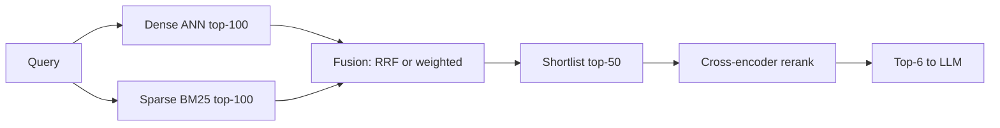
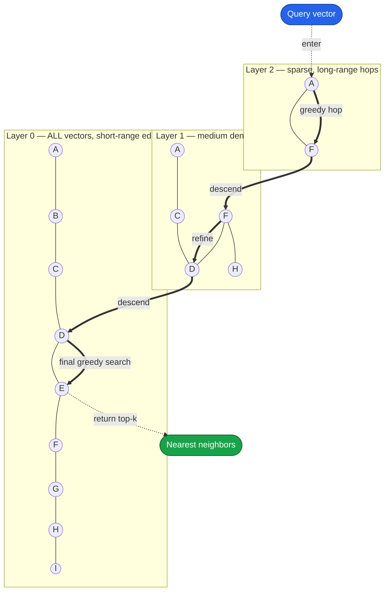
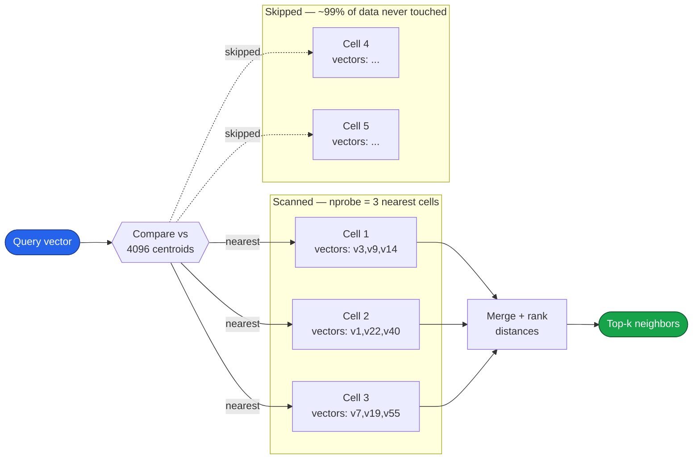
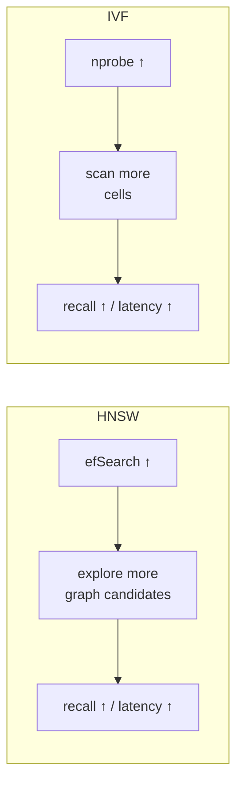

# GenAI Quick Reference — Vector Search, Fusion & ANN Indexes

## Quick Look

Fast recall of the core ideas covered below. Skim this, dive into a section when you need the detail.

- **ANN indexes:** vector databases search fast with Approximate Nearest Neighbor algorithms — **HNSW** (graph navigation) or **IVF** (cluster/cell probing). Both trade a little accuracy for large speedups over brute force.
- **Recall:** the percentage of the true, mathematically closest vectors that your search actually returns. The key accuracy metric for ANN search.
- **Hybrid retrieval:** run **dense (ANN)** + **sparse (BM25)** in parallel, fuse with **RRF**, then **cross-encoder rerank** the shortlist. Reranking is the biggest precision lever.
- **Bi-encoder vs cross-encoder:** bi-encoder embeds query and docs *separately* (fast, precomputable, used for retrieval); cross-encoder reads query + doc *together* (slow, precise, used for reranking top 50–200).
- **Sharding:** size each shard to a few million vectors so its index fits in RAM, scatter-gather across shards in parallel, replicate ×2–3 for HA and QPS.
- **Quantization:** **int8** ≈ 4× smaller at ~99% recall (start here); **PQ / IVF-PQ** ≈ 16–32× for extreme scale, paired with full-vector reranking to recover precision.
- **Tuning dials:** HNSW `efSearch` and IVF `nprobe` are the runtime recall-vs-latency knobs — turn up for recall, down for speed.
- **Maximal Marginal Relevance(MMR):** MMR is a retrieval strategy that balances relevance to the query with diversity among retrieved documents. It prevents redundant chunks from occupying the LLM's context window, resulting in richer context and better RAG responses.

| Topic | One-liner |
|---|---|
| HNSW | Multi-layer proximity graph; highway hops at top, local steps at bottom; RAM-hungry |
| IVF | K-means cells; probe only the `nprobe` nearest cells; pairs with PQ for compression |
| RRF | Rank-based fusion of dense + sparse lists ($k = 60$) |
| Cross-encoder | Joint query+doc scoring for precise reranking |
| int8 quantization | 4× smaller, ~99% recall — the default |
| Shard sizing | Few-M vectors/shard in RAM; scatter-gather; replicate ×3 |

---

## Hybrid Fusion + Rerank

### Retrieval pipeline shape

---

## Vector DB Sharding & Sizing

### Simple shard calculation

#### Step 1 — Count your vectors

$$
N = \text{docs} \times \text{chunks per doc}
$$

Example: $1\text{M docs} \times 30 = 30\text{M vectors}$

#### Step 2 — Bytes per vector (after quantization)

$$
\text{bytes/vec} = \underbrace{d \times b}_{\text{vector}} + \underbrace{\sim200}_{\text{graph overhead}}
$$

- $d$ = dimension (e.g. 768)
- $b$ = bytes/dim → float32 = 4, **int8 = 1**

Example (int8): $768 \times 1 + 200 \approx 1\text{ KB/vec}$

#### Step 3 — How many vectors fit per node

$$
N_{\text{shard}} = \frac{\text{RAM budget per node}}{\text{bytes/vec}}
$$

Example: $\dfrac{8\text{ GB}}{1\text{ KB}} = 8\text{M vectors/shard}$

#### Step 4 — Number of shards

$$
S = \left\lceil \frac{N}{N_{\text{shard}}} \right\rceil
$$

Example: $\lceil 30\text{M} / 8\text{M} \rceil = 4 \text{ shards}$

#### Step 5 — Total nodes (add replicas for HA)

$$
\text{nodes} = S \times R
$$

Example: $4 \times 3 = 12 \text{ nodes}$

### One-line memory formula

$$
\text{Total RAM} = N \times \text{bytes/vec}
$$

$30\text{M} \times 1\text{ KB} = 30\text{ GB} \Rightarrow$ split into 4 shards of ~7.5 GB each.

**Cheat sheet:**

| Symbol | Meaning | Example |
|--------|---------|---------|
| $N$ | total vectors | 30M |
| bytes/vec | after int8 | ~1 KB |
| $N_{\text{shard}}$ | RAM ÷ bytes/vec | 8M |
| $S$ | $\lceil N / N_{\text{shard}} \rceil$ | 4 |
| $R$ | replicas | 3 |
| nodes | $S \times R$ | 12 |

**Rule of thumb:** size each shard to a few million vectors so its index fits in RAM and searches fast, then replicate ×2–3.

### Sharding strategy: random vs semantic

| Strategy | How | Pro | Con |
|----------|-----|-----|-----|
| **Random/hash** | hash(chunk_id) % S | even load, simple | every query hits all shards |
| **Semantic** (cluster-based) | route by nearest centroid | query only relevant shards ⇒ less compute | hot shards, rebalancing needed |

Start with **random sharding** (predictable, balanced). Move to semantic routing only if compute cost dominates and your data clusters cleanly.

### Putting the numbers together (final sizing)

For **30M vectors, d=768**, targeting low latency + high recall:

- **Index**: HNSW + **int8 scalar quantization** (or IVF-PQ if memory-constrained).
- **Memory**: ~29 GB total (int8) → **4 shards** of ~7.5M vectors (~7 GB each).
- **Replication**: R=3 → **12 nodes**.
- **HNSW params**: M=32, efConstruction=200, efSearch=64–128 (efSearch = recall/latency dial).
- **Query**: parallel scatter-gather across 4 shards, ~64–128 comparisons per HNSW hop, per-shard latency ~10–30 ms → **p95 retrieval < 80 ms**.
- **Then**: fuse with BM25 (RRF) → rerank top-50 → top-6 to LLM.

### Key parameter cheat-sheet

| Parameter | Formula / default | Effect |
|-----------|-------------------|--------|
| HNSW `M` | 16–32 | graph degree; ↑ = recall + memory |
| HNSW `efSearch` | 64–256 | ↑ = recall + latency |
| IVF `nlist` | $\approx \sqrt{N}$ | partition granularity |
| IVF `nprobe` | 8–64 | ↑ = recall + latency |
| PQ `m` | divisor of $d$ | ↑ = fidelity, ↓ compression |
| Shard count `S` | $\lceil N / N_{\text{shard}}^{\max}\rceil$ | fit RAM + latency |
| Replicas `R` | 2–3 | HA + throughput |

### Bottom line

- **Fusion**: RRF ($k=60$) for robust rank-based combination; cross-encoder rerank on the top-50 is the biggest precision lever.
- **Quantization**: int8 gives 4× shrink at ~99% recall (start here); PQ/IVF-PQ gives 16–32× for extreme scale, paired with full-vector reranking to recover precision.
- **Sharding**: size shards to fit ~few-M vectors in RAM, parallel scatter-gather bounds latency by the slowest shard, replicate ×3 for HA.

---

## Bi-Encoder vs Cross-Encoder

### Bi-Encoder

> "The same embedding model independently encodes the query and documents into vectors. Document embeddings are precomputed and stored in a vector database. At query time, the query embedding is compared against stored document embeddings using vector similarity to retrieve the top candidates."

### Cross-Encoder (Reranker)

> "The cross-encoder takes the raw query text and raw document text together as input, allowing all query tokens to attend to all document tokens. It outputs a relevance score for reranking the retrieved candidates. Since the query and document must be processed together, document representations cannot be precomputed."

### Comparison

| Feature                    | Bi-Encoder            | Cross-Encoder               |
| -------------------------- | --------------------- | --------------------------- |
| Input                      | Query **or** Document | Query **+** Document        |
| Input type                 | Raw text (separately) | Raw text (together)         |
| Output                     | Embedding vector      | Relevance score             |
| Documents precomputed?     | ✅ Yes                 | ❌ No                        |
| Query-document interaction | ❌ No                  | ✅ Yes                       |
| Search method              | Vector similarity     | Transformer inference       |
| Speed                      | Very fast             | Slow                        |
| Best use                   | Initial retrieval     | Reranking                   |
| Scale                      | Millions of docs      | Top 50–200 retrieved chunks |

---

## ANN Index Internals: HNSW vs IVF

### HNSW — hierarchical layers + search descent

The query enters at the sparse top layer, greedily hops to the closest node, then drops a layer and refines — coarse-to-fine.

Read it as: **highway jumps at the top** (few nodes, big distance) → **local streets at the bottom** (every vector, fine precision). Sub-linear because you skip almost all nodes.

### IVF — cluster the space, probe only the nearest cells

The query is compared against centroids first, then only the vectors inside the `nprobe` closest cells are scanned.

Read it as: **coarse quantizer prunes buckets** — you only scan the cells whose centroids are closest, skipping the rest. `nprobe` = how many cells you scan.

### Tuning knobs, visualized

### How IVF partitions data

IVF (Inverted File index) works by **clustering the vector space** before any query arrives:

1. **Training:** run k-means over a sample of vectors to find, say, 4096 **centroids**. Each centroid defines a **cell** (a Voronoi region) — a "bucket" of vectors near it. This is the "inverted list": centroid → list of vectors assigned to it.
2. **Insert:** each vector is assigned to its nearest centroid's list.
3. **Search:** embed the query, find the `nprobe` **closest centroids** (e.g., the nearest 16 of 4096), and **only scan the vectors in those cells**. You skip the other ~99.6% of the data.

So IVF's speedup is a **coarse quantizer that prunes cells**, whereas HNSW's speedup is **graph navigation**. Different mechanism, same goal (avoid brute force).

`nprobe` is the recall/latency dial: more cells probed → higher recall, slower query (the IVF analog of HNSW's `efSearch`).

### Does IVF change sharding across nodes?

**Mostly no — you still scatter-gather.** When the dataset outgrows one machine, you split it into shards across nodes, and because similarity search has no "shard key" that maps a query to one shard, a query must still fan out to **all shards**, each returns its local top-k, and you **merge**. That part is identical to HNSW.

But there are three IVF-specific nuances worth naming:

**1. IVF gives you a *natural* partitioning unit — the cell.**
Because data is already grouped into inverted lists by centroid, one clean way to shard is **by cell/centroid ranges**: shard A owns cells 0–2047, shard B owns cells 2048–4095. This is a more "principled" partition than HNSW, where you typically just hash/round-robin vectors into shards.

**2. That opens a routing optimization HNSW doesn't easily allow.**
If shards align with centroid ranges, the query can first find its nearest centroids (cheap — just comparing against 4096 centroids) and then **only scatter to the shards that own those cells**, instead of all shards. So IVF *can* reduce the fan-out — a partial "shard pruning." In practice many systems still query all shards for simplicity/recall, but the option exists because the coarse quantizer already tells you where the answer probably lives. HNSW has no equivalent global map, so it almost always hits every shard.

**3. Memory story is different — which changes *why* you shard.**

- **HNSW** is RAM-hungry (full vectors + graph in memory), so you often shard because you **run out of RAM**.
- **IVF is usually paired with PQ (Product Quantization) → IVF-PQ**, which compresses each vector into a tiny code (e.g., 32 bytes instead of 6 KB). That's ~50–200× smaller, so a single node holds far more vectors. You can push to billions of vectors before sharding for *size*. So with IVF-PQ you more often shard for **QPS/throughput** than for capacity — the opposite emphasis from HNSW.

The replica axis is identical regardless of index type: copies of each shard behind a load balancer, eventual consistency fine. Nothing IVF-specific there.

### HNSW vs IVF summary

| Aspect | HNSW | IVF / IVF-PQ |
|---|---|---|
| Intra-node pruning | Graph navigation | Probe nearest `nprobe` cells |
| Natural shard unit | None (hash/round-robin) | Cell/centroid ranges |
| Can prune shards at query time? | No — hit all shards | Yes (optionally) — route to shards owning nearest cells |
| Why you shard | Often **RAM** (vectors + graph) | Often **QPS** (PQ makes it memory-cheap) |
| Recall/latency knob | `efSearch` | `nprobe` |
| Replicas for QPS | Same scatter-gather + replicas | Same |

**One-liner:** IVF doesn't change the fundamental scatter-gather-across-shards model, but its centroid cells give you a *natural, prunable* partition key that can (optionally) cut fan-out, and IVF-PQ's compression shifts the reason-to-shard from "out of RAM" toward "out of QPS."
